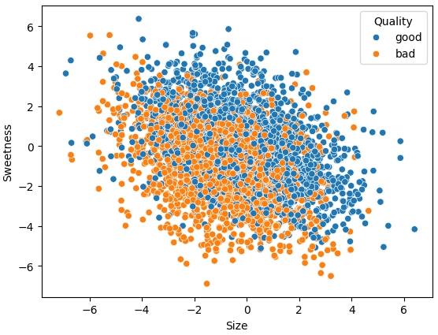
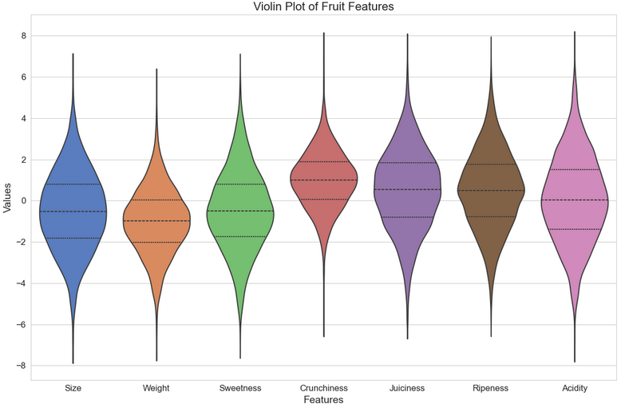
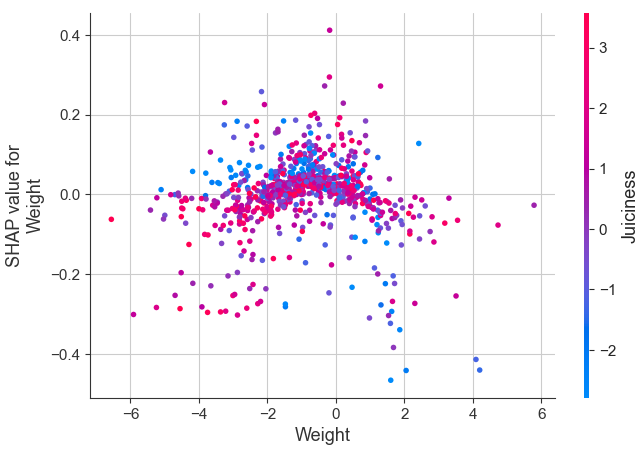

# Apple qualities
The dataset contains characteristics such as size, weight, sweetness, crispness, juiciness, ripeness, acidity, and quality.
Based on the input numerical data, the model estimates what the quality of the apple will be (good/bad) in the end. 

Data source: [kaggle.com](https://www.kaggle.com/datasets/nelgiriyewithana/apple-quality)

## Dataset
The dataset contains 4000 rows. The parameters are on a -8-to-8-grade scale. Watching them 1-to-1 one cannot see any direct correlation between 2 parameters, that's why I considered I needed to examine it with ML algorithms.

I made a violin plot where one can see the different distributions of the parameters.

## Machine Learning
After the required transformations, I trained the model.
Firstly, I tried the Support Vector Machines model, and it worked well. Even so, I tried the undermentioned models, too.

Firstly, I was scaling the features with StandarnScaler.
Then, I made the following methods run:
- Logistic Regression,
- Linear Discriminant Analysis,
- K-Neighbors Classifier,
- Decision Tree Classifier,
- Gaussian Naive Bayes,
- C-Support Vector Classification.

For the assessment of models I used accuracy, precision and recall.
The best performing models were:
- K-Neighbors Classifier (in accuracy),
- Decision Tree Classifier (in precision and recall).
The C-Support Vector Classification worked well measured by all 3 metrics.

The non-mentioned models' values were at 0.75 at all 3 metrics.

It is worth mentioning that the C-Support Vector Classification was very slow compared to all other models, so despite the fact it was accurate, it is not efficient.

## Further investigations
In order to understand how the models calculated, I made further calculations with Shapley, over and above with XGBoost.

